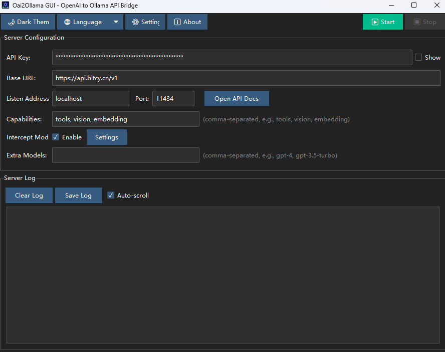
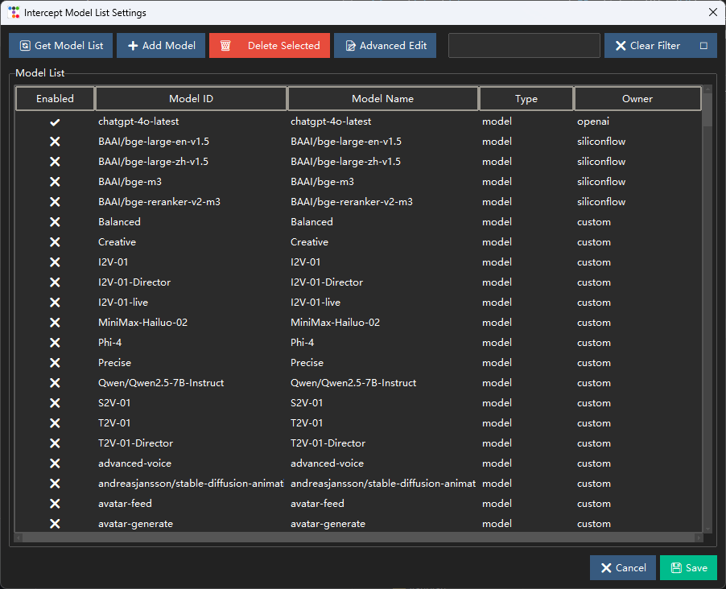
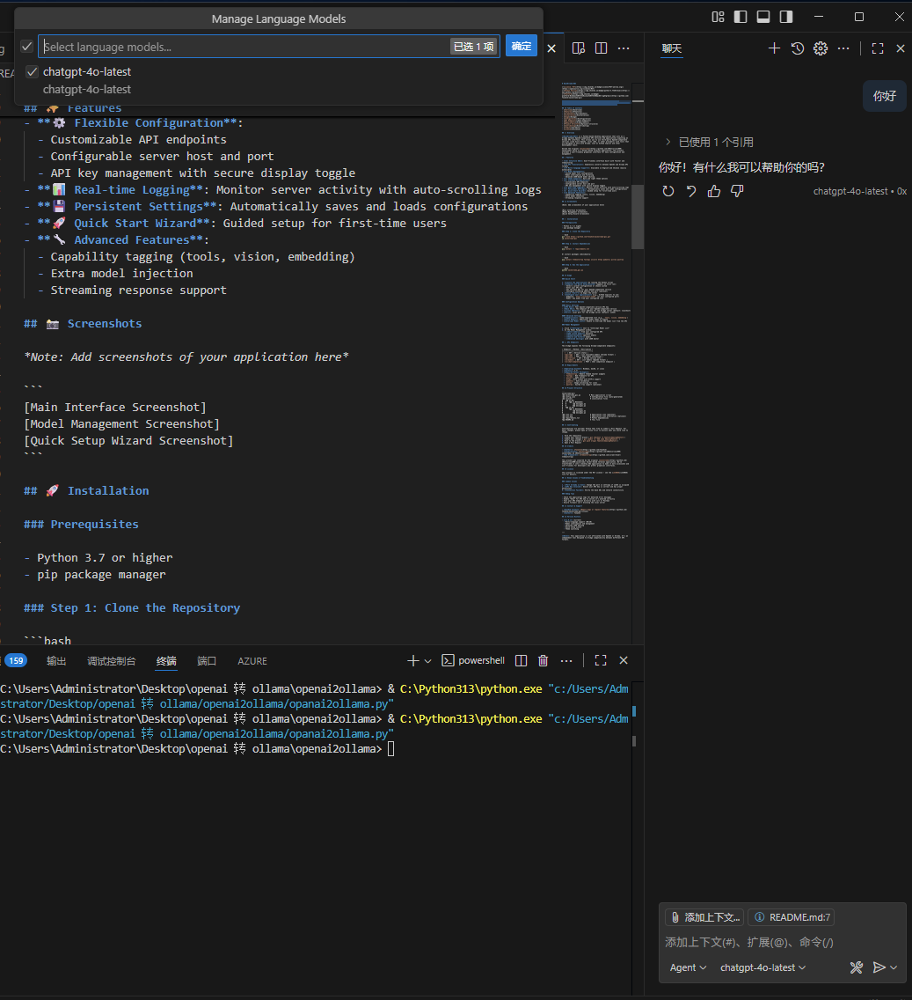

# Oai2Ollama-GUI


[](https://opensource.org/licenses/MIT) 

[](https://www.python.org/downloads/) 

[](https://github.com/Tonyhzk/oai2ollama-gui) 


一款桌面图形用户界面（GUI）应用程序，它将兼容 OpenAI 的 API 桥接到兼容 Ollama 的 API，使得像 GitHub Copilot 这样的工具能够通过一个本地的、类似 Ollama 的接口，无缝地使用第三方 AI 平台。


## 📋 目录

- [概述](#概述) 
- [功能](#功能) 
- [截图](#截图) 
- [安装](#安装) 
- [使用方法](#使用方法) 
- [配置](#配置) 
- [API 端点](#api-端点) 
- [环境要求](#环境要求) 
- [项目结构](#项目结构) 
- [贡献](#贡献) 
- [致谢](#致谢) 
- [许可证](#许可证) 


## 🎯 概述


**Oai2Ollama-GUI** 是一款基于 Python 的桌面应用程序，它充当了兼容 OpenAI 的 API 服务与需要 Ollama API 接口的应用程序之间的桥梁。这让您能够将第三方兼容 OpenAI 的服务（如 Azure OpenAI、本地大语言模型或其他提供商）与那些为 Ollama 设计的工具（如 GitHub Copilot 和其他开发工具）结合使用。


与原版 [oai2ollama](https://github.com/CNSeniorious000/oai2ollama)（一个基于 Docker 的终端应用程序）不同，本项目提供了一个用户友好的图形界面，以便于配置和管理。


## ✨ 功能


- **🖥️ 直观的图形用户界面**: 使用 Tkinter 和 ttkbootstrap 构建的用户友好界面
- **🔄 API 转换**: 在 OpenAI 和 Ollama API 格式之间无缝转换
- **🌐 多语言支持**: 提供英文和中文版本（易于扩展）
- **📝 模型管理**: 
  - 自定义模型列表配置
  - 模型拦截与过滤
  - 基于 JSON 的高级模型编辑
- **🎨 主题支持**: 提供深色和浅色主题选项
- **⚙️ 灵活的配置**: 
  - 可自定义的 API 端点
  - 可配置的服务器主机和端口
  - API 密钥管理，支持安全显示切换
- **📊 实时日志**: 通过自动滚动的日志监控服务器活动
- **💾持久化设置**: 自动保存和加载配置
- **🚀 快速启动向导**: 为首次使用的用户提供引导式设置
- **🔧 高级功能**: 
  - 能力标签（工具、视觉、嵌入）
  - 额外模型注入
  - 流式响应支持


## 📸 截图

主界面


模型列表


copilot



## 🚀 安装


### 先决条件


- Python 3.7 或更高版本
- pip 包管理器


### 第一步：克隆仓库


```bash
git clone https://github.com/Tonyhzk/oai2ollama-gui.git
cd oai2ollama-gui
```


### 第二步：安装依赖


```bash
pip install -r requirements.txt
```


或者单独安装各个包：


```bash
pip install ttkbootstrap fastapi uvicorn httpx pydantic pillow pystray
```


### 第三步：运行应用程序


```bash
python oai2ollama_gui.py
```


## 📖 使用方法


### 快速入门


1.  **启动应用程序**：运行 Python 脚本
2.  **完成快速设置向导**（首次运行时出现）：
    -   选择一个预设配置或选择自定义
    -   输入您的 API 密钥
    -   设置您兼容 OpenAI 的服务的基础 URL
    -   配置监听地址和端口（可选）
3.  **点击“启动”**以开始服务
4.  **配置您的应用程序**（例如 GitHub Copilot）以使用：
    -   端点：`http://localhost:11434`（或您配置的端口）
    -   模型：您配置的模型列表中的任何模型


### 配置选项


#### 基本设置
- **API 密钥**: 您兼容 OpenAI 的服务的 API 密钥
- **基础 URL**: 您兼容 OpenAI 的服务的端点
- **监听地址**: 桥接服务器的本地地址（默认为：localhost）
- **端口**: 桥接服务器的本地端口（默认为：11434）


#### 高级设置
- **能力**: 以逗号分隔的列表（例如：`tools, vision, embedding`）
- **额外模型**: 额外暴露的模型名称
- **拦截模型列表**: 启用此项以覆盖从 API 获取的模型列表


### 模型管理


1.  点击“拦截模型列表”旁边的 **“设置”**
2.  在模型管理窗口中：
    -   从您配置的 API **获取模型**
    -   手动**添加自定义模型**
    -   **启用/禁用**特定模型
    -   **搜索和过滤**模型
    -   使用 JSON 编辑器进行**高级编辑**


## 🔌 API 端点


该桥接服务暴露了以下兼容 Ollama 的端点：


| 端点 | 方法 | 描述 | 
|----------|--------|-------------| 
| `/` | GET | 服务状态 | 
| `/api/tags` | GET | 列出可用模型（Ollama 格式） | 
| `/api/show` | POST | 显示模型信息 | 
| `/api/version` | GET | Ollama 版本信息 | 
| `/v1/models` | GET | 列出模型（OpenAI 格式） | 
| `/v1/chat/completions` | POST | 聊天补全端点 | 


## 📋 环境要求


- **操作系统**: Windows、macOS 或 Linux
- **Python**: 3.7+
- **所需的 Python 包**: 
  - `ttkbootstrap`: 现代主题的 tkinter 控件
  - `fastapi`: 用于 API 的 Web 框架
  - `uvicorn`: ASGI 服务器
  - `httpx`: 支持 HTTP/2 的 HTTP 客户端
  - `pydantic`: 数据验证
  - `pillow`: 用于图标的图像处理
  - `pystray`: 系统托盘支持（可选）


## 📁 项目结构


```
oai2ollama-gui/ 
├── oai2ollama_gui.py          # 主应用程序脚本
├── config.json                 # 配置文件（自动生成）
├── locales/                    # 本地化文件
│   ├── en_US/ 
│   │   └── LC_MESSAGES/ 
│   │       ├── messages.mo
│   │       └── messages.po
│   └── zh_CN/ 
│       └── LC_MESSAGES/ 
│           ├── messages.mo
│           └── messages.po
├── icon.ico                    # 应用程序图标（可选）
├── icon.png                    # 应用程序图标替代（可选）
├── requirements.txt            # Python 依赖项
└── README.md                   # 本文件
```


## 🤝 贡献


欢迎贡献！请随时提交 Pull Request。对于重大更改，请先开启一个 issue 来讨论您想要更改的内容。


1.  Fork 本仓库
2.  创建您的功能分支 (`git checkout -b feature/AmazingFeature`) 
3.  提交您的更改 (`git commit -m 'Add some AmazingFeature'`) 
4.  推送到分支 (`git push origin feature/AmazingFeature`) 
5.  开启一个 Pull Request


## 🙏 致谢


- **作者**: [Tonyhzk](https://github.com/Tonyhzk) 
- **灵感来源**: CNSeniorious000 的 [oai2ollama](https://github.com/CNSeniorious000/oai2ollama)
- **UI 框架**: [ttkbootstrap](https://github.com/israel-dryer/ttkbootstrap) 


本项目受到了原版 [oai2ollama](https://github.com/CNSeniorious000/oai2ollama)（一个基于 Docker 的终端应用程序）的启发。我们将其转化为一个桌面 GUI 应用程序，以便于那些偏好图形界面的开发者使用，使其更易于访问和使用。


## 📄 许可证


本项目根据 MIT 许可证授权 - 详情请参阅 [LICENSE](LICENSE) 文件。


## 🐛 已知问题与故障排除


### 常见问题


1.  **端口已被占用**: 如果 11434 端口被占用，请在设置中更改端口
2.  **API 密钥无效**: 确保您的 API 密钥正确且具有适当的权限
3.  **连接失败**: 验证基础 URL 和网络连接性


### 调试技巧


-   检查应用程序日志以获取详细的错误信息
-   启用 API 密钥的“显示”功能以验证其输入是否正确
-   使用 curl 或 Postman 直接测试您的 API 端点
-   确保防火墙没有阻止本地服务器


## 📮 联系与支持


- **GitHub Issues**: [报告错误或请求功能](https://github.com/Tonyhzk/oai2ollama-gui/issues) 
- **作者**: Tonyhzk


## 🔄 版本历史


- **v1.0.1** (当前版本) 
  - 多语言支持 (中/英) 
  - 模型拦截与管理
  - 高级 JSON 编辑
  - 快速设置向导
  - 主题切换


--- 


**注意**：本应用程序不隶属于 OpenAI 或 Ollama。它是一个独立的工具，旨在桥接不同 API 格式之间的兼容性。